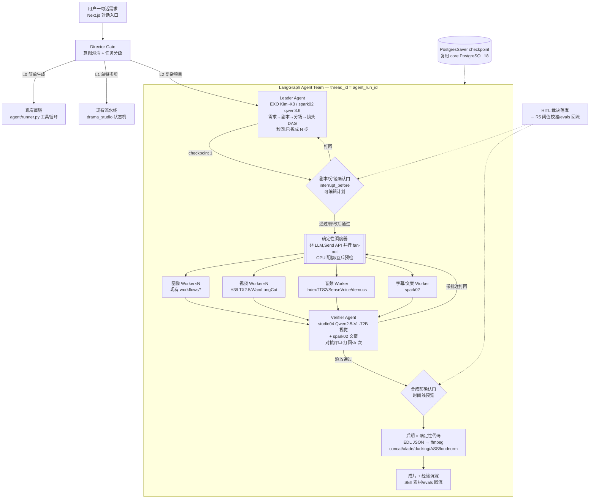

# 竞品深度调研:R3-R5 落地深化(2026-08-14)

> 承接 [2026-08-13-competitive-research-roadmap.md](2026-08-13-competitive-research-roadmap.md)(R1-R5 路线图)。上轮已完成能力矩阵与 R1(质量门/指代消解)、R2(Wan2.2-Animate/VACE+参考资产库)落地,LTX-2.5 已替换 SFW LTX-2.3。本轮聚焦 **R3 主 Agent 统一入口 + 多 Agent 并行**(重点,约一半篇幅)、**R4 Skills 广场**、**R5 评测闭环完整化**,并刷新竞品 2026 年最新动态。
> 性质:调研报告 + 落地设计草案(不含实现代码)。所有关键结论附来源;查不到实据的明确标注。

---

## 〇、执行摘要

**2026 年 Agent 化创作的范式已从「单 Agent 长任务」收敛为「三角色团队 + 计划可见 + 断点续跑」**:

1. **R3 核心结论**:MiniMax Mavis 官方把团队角色定名为 **Leader / Worker / Verifier**(⚠️ 修正上轮"Owner"的表述),Worker 与 Verifier 是**刻意对抗**关系(开发 vs QA);「主 Agent 秒回 + 后台拆分 + 关键节点汇报」被 MiniMax 确认为治"Agent 失联感"(其最大单一反馈来源)的标准答案。Manus 于 2026-07-22 上线 **Plan Mode**(执行前可审阅计划),Skywork 3.1 的 Dynamic Workflows 内置**专项复核智能体 + 断点续跑**——「计划可见、对抗验收、checkpoint 恢复」三件套已是 2026 年头部产品的标配而非差异化。框架终判:**LangGraph**(2025-10 起 1.0 LTS,LangChain 官方运行时,唯一带持久化容错的主流框架,模型无关,MIT)继续做 ToIV 编排底座;OpenAI Agents SDK(vendor lock)与 Google ADK(绑 GCP)均不适合自托管约束。
2. **R4 核心结论**:SKILL.md 已是**事实开放标准**(Anthropic 2025-12-18 开源,2026-02 达 8.5 万+ 公开 skills、27 家平台采纳,含 Manus/Cursor/千问官方);商店经济学 2026 年数据继续验证上轮判断——GPT Store 创作者中位收入仅 ~$47/月、top 1% 拿走 78%、300 万 GPT 仅 5.3% 存活;扣子技能商店(70-95% 分成、上架资质审核)与堆友「设计专家 AI Skill 计划」(100 名专家共建、设计师品牌交易)代表**严选供给侧**路线。ToIV 一期做「官方严选 + evals 机验 + 安装即用」,不做分成。
3. **R5 核心结论**:2026 年评测方法论最大变化是 **pairwise(成对比较)取代 pointwise(绝对打分)**——GenArena 实证开源 VLM 评委仅改用 pairwise 协议即可超越顶级闭源评委(评测准确率 +20%,与 LMArena 的 Spearman 相关 0.36→0.86),这对 ToIV 用自托管 Qwen2.5-VL-72B 当评委是重大利好;Adobe(WACV 2026)的「专科小模型辅助 VLM 评委」路线与我们 L1/L2/L3 漏斗天然契合,ICL +2-8%、微调 +13% 人类对齐。评委进 CI 的红线:金标集校准 Cohen's kappa ≥0.7。

---

## 一、R3:主 Agent 统一入口 + 多 Agent 并行

### 1.1 竞品 UX 拆解(2026 年最新)

#### 1.1.1 MiniMax:Mavis(Agent Team)+ Hub(画布工作站)+ Code 2.0

**⚠️ 对上轮的修正**:上轮称「MiniMax Design/Mavis,Owner/Worker/Verifier」。本轮查实:① 官方角色名为 **Leader / Worker / Verifier**(非 Owner);② **未找到名为"MiniMax Design"的独立产品公开实据(本轮)**——MiniMax 2026 年 Agent 产品线是 **Mavis(桌面端 Agent Team)、MiniMax Hub(桌面画布工作站)、MiniMax Code 2.0(编码 Agent)** 三件套;③ 上轮的五步链路描述无法在本轮公开资料中复验,按官方博客重新归纳如下。

**Mavis / Agent Team 机制**([MiniMax 官方博客 2026-04/05](https://www.minimaxi.com/blog/minimax-agent-team-long-running-1779893521)、[英文版](https://www.minimax.io/blog/minimax-agent-team-long-running-1779893953)、[KDNuggets 实测 2026-08-03](https://www.kdnuggets.com/does-minimax-agent-actually-make-work-easier)):

- **三角色协作流**:Leader 把用户目标转化为任务结构(决定要不要拆、谁能并行、什么必须验收);Worker 执行具体子任务(不同 Worker 有不同工具、上下文、输出要求);Verifier 核查来源、覆盖度、风险边界,**可打回 Worker 重做**。官方明言 Worker↔Verifier 是「刻意对抗」关系——如同开发团队与 QA 团队都想让项目上线,但任何一方都不能自己说了算。
- **为什么做 Team**:单 Agent 三大病——上下文焦虑导致意外停机("做完 3/7 就停下来汇报")、长任务越跑越笨且偏差沿链路放大、无法秒回长周期任务。**「我的 Agent 怎么不回我了」是 MiniMax 收到的最大单一用户反馈**。
- **UX 标准动作**:主 Agent **先秒回**「收到任务、目标已确认、将在后台拆分执行」→ 拆成多个章节包/版本**并行执行** → 用户不必等每个子步骤,只在关键节点收到汇报:**任务已开始 / 遇到阻塞 / 需要决策 / 已经完成** → 用户可随时插入新想法,Leader 另开一组 Agent 并行研究并汇报。
- **官方的成本告诫(罕见坦诚)**:MiniMax 自己引用研究承认,**无结构的多 Agent 协作在简单任务上 token 成本可达 3 倍以上且无准确率收益**,Agent Team 只在「长、可验证」的任务上回本。KDNuggets 实测背书此结论。
- **持续进化**:经验沉淀(哪些坑下次避开)是 Team 设计的一等目标,与 Skill 迭代正交。

**MiniMax Hub**([myaiguide 2026-05-08](https://myaiguide.co/news/rj-minimax-hub-mowkocob),二手报道,可信度中):桌面 AI 工作站,**Agent 驱动的可视画布**,拖拽 Agent 组成工作流,本地算力+云端模型混合。媒体评价谨慎:可视编排能否处理嵌套/递归逻辑与本地-云端同步延迟是未知数。**未找到官方详细文档,UX 细节为推断**。

**MiniMax Code 2.0**([aitoolsreview 2026-08-09](https://aitoolsreview.co.uk/insights/minimax-code-2) + [官方 changelog](https://agent.minimax.io/docs/changelog)):2026-07-13 v3.0.48 起核心重写(中文媒体称基于开源 Pi agent 框架,官方英文 changelog 未证实),官方自称 p95/p99 首 token 延迟降 90%+;后续版本加 Remote Control、内置浏览器+Browser Control、**Goal Mode**、BYOK。底座默认 M3(2026-06-01 发布,MSA 稀疏注意力,最高 1M 上下文,原生多模态)。

**对 ToIV 的启示**:Leader/Worker/Verifier 三角 + 秒回 + 关键节点汇报四态(开始/阻塞/需决策/完成)直接照搬;「简单任务不上 Team」写成任务分级规则,避免 token 浪费。

#### 1.1.2 Manus:Plan Mode + Wide Research + Agent Skills + 公司独立

[Manus 完整时间线(scriptbyai,2026-08-12 更新)](https://www.scriptbyai.com/manus-ai-timeline/)、[Wide Research 官方文档](https://help.manus.im/en/articles/11960169-what-is-wide-research)、[sarmalinux 实测](https://www.sarmalinux.com/blog/manus-1-6-max-wide-research-autonomous-agents-go-wide):

- **2026-07-22 Plan Mode 上线**:Manus 开工前先给出**可审阅的执行计划**,用户确认后再跑——上轮我们归纳的「计划可见性」已被 Manus 官方产品化,成为行业标配动作。
- **Wide Research(2025-07 上线,1.6 强化)**:复杂任务自动触发,**最多 20 个并行子 Agent**,关键设计是**子 Agent 不设预定角色,每个都是完整 Manus 实例**(与 MiniMax 的固定 Leader/Worker/Verifier 角色化路线相反);付费用户专属,单子任务积分上限 50;1.6 MAX 版子 Agent 用更强模型。官方定位:单核→多核。
- **1.6 Max 架构**(2026-04/05):小时级长任务不丢线;工具选择错误率 anecdotal ~15%→~3%。
- **2026-01-27 采纳 Agent Skills**:工作流可打包为 Skill(文件制标准),斜杠命令调用——通用 Agent + SKILL.md 生态。
- **2026-07-09 Branch**:一个任务分叉出继承上下文的并行会话(计划/探索的双轨)。
- **公司动态**:2025-12 宣布加入 Meta → 2026-04-27 中国监管责令撤回收购 → **2026-08-11 宣布重新独立运营**(8-23 前部分用户需备份数据)。ToIV 不受影响,但说明 Manus 系外部依赖的合规风险真实存在。
- **任务卡片 UX**:Manus 的「云端异步执行 + 完成通知 + replay 回放」仍是长任务体验的参照系;其 Web App Builder(DB+Stripe+SEO)说明 2026 年 Agent 交付物已从文档升级到可运行应用。

**对 ToIV 的启示**:Plan Mode 确认门放在「剧本/分镜」层;Wide Research 的「无角色全副本并行」适合我们的多镜头 fan-out(每个镜头 Worker 都是同一套渲染工具调用,无需差异化角色),而 Verifier 对抗评审放在镜头级与成片级两处。

#### 1.1.3 Skywork(天工):3.1 的 Design 画布 + Dynamic Workflows

[中证网 2026-06-17](https://www.cs.com.cn/ssgs/01/2026/06/17/detail_2026061710018955.html)、[昆仑万维官微 2026-05-18](https://m.10jqka.com.cn/20260518/c676772672.shtml):

- **Skywork 3.1(2026-06-17)双新功能**:
  - **Skywork Design 专属画布**:无限画布替代线性对话框,覆盖官网整站/APP 原型/文档转 UI/参考图复刻四场景;**品牌规范固化**——保证数十轮迭代后视觉规范统一(深度用户单项目平均迭代超 40 轮,说明「多轮迭代不漂移」是真痛点)。
  - **Dynamic Workflows**:**同时调度数十到上百个并行子智能体**,自动拆解批量任务、多智能体分工协作、**交叉核验结果**;设**专项复核智能体提前拦截误差**;**支持任务断点续跑**。
- **技能广场(5-18 升级)**:严选 Skills(官方打磨)+ **Skill Agent 对话创建自定义 Skill**(描述工作场景即可,无需编程)+ **自我进化**(随用户反馈自主优化 Skill 执行策略);全模态编辑器(PPT/文档/表格/图片无限画布/视频轨道/网站可视化),**手动编辑不消耗积分**。
- **商业数据**:3.0 上线后超级智能体业务收入环比 +200%;GAIA 82.42%。

**对 ToIV 的启示**:「专项复核智能体 + 断点续跑」与 LangGraph 的 Verifier 节点 + checkpointer 一一对应,验证了我们的技术路线;「手动编辑不消耗积分」值得借鉴——ToIV 用户手工微调产物(改文案/替换图)应零成本,只为重生成计费。

#### 1.1.4 Lovart:全球正式商用 + ChatCanvas + Move Object

[ai-damn 2026-08-10](https://ai-damn.com/lovart-ai-launches-globally-redefining-design-with-full-chain-intelligence-1753398441636)、[Lovart Skills 官方](https://lovart.pro/lovart-skills)、[Move Object 发布(日文)2026-03-27](https://hokihosting.com/business/142647/):

- **2026-08-10 全球正式商用**(Beta 毕业):80 万用户、70+ 国;核心叙事「全链路设计智能 + 自然语言交互」。
- **ChatCanvas**:无限智能画布,**支持多轮对话**——自然语言实时调布局/配色;**长期记忆**学习用户偏好。
- **Skills 三分法(20+ 个)**:**Agent Skills**(对话与流程管理:Chat 驱动设计、文件上传 ≤10 个参考、Web 搜索、Thinking/Fast 双模式、@提及、模型选择)/ **Tools Skills**(生成:文生图/视频、加入画布)/ **Canvas Skills**(精修:图中改字、元素编辑、AI 消除、扩图、去背景、裁剪、超分、Mockup)。**「画布操作本身 Skill 化」**是 Lovart 与别家最大的结构差异。
- **Move Object(2026-03)**:矩形/套索圈选对象→拖拽移动→AI 自动补全原空白与新位置光影;移动同时可下提示词微调(移动角色+换掉手持物)。**消灭「再生成抽卡」**。
- 模型聚合:GPT Image 2、Nano Banana Pro、Grok Imagine、Veo 3、Kling 等;国内版「星流 Agent」。

**对 ToIV 的启示**:Skills 不止「生成配方」,**后处理操作(改字/扩图/局部重绘/超分)也应封装为可调用 Skill**——ToIV 已有 removebg/upscale/inpaint 工作流,R4 时全部 Skill 化;Move Object 证明「确定性画布操作 + AI 补全」比整图重生成体验好一个量级,可作为 R3 干预操作的第五类(移动/圈改)。

#### 1.1.5 Flowith:Agent Neo + FlowithOS + 种子轮

[postunreel 评测 2026-06-10](https://postunreel.com/blog/flowith-review)、[Z Potentials 融资报道 2026-03-04](https://m.aitntnews.com/newDetail.html?newId=22794)、[gongke 产品页](https://gongke.net/tools/flowith):

- **2026-03-04 完成千万美元种子/种子+轮**(祥峰、红杉中国种子、江远):定位「行动派 OS」。
- **Agent Neo**:自称首个"无限 Agent"——**10M token 上下文、单任务 1000+ 推理步、7×24 云端执行**(关标签页继续跑);**人机协作界面**:生成初步工作流后与用户互动确认细节,用户可修改/补充/添加完全不同的执行路径;**流程回放**(完成后可复现整个工作流,知识传递)。
- **FlowithOS**:本地化全链路创作助手(自主操控浏览器与桌面软件),内测中,自称主流 Agent Benchmark SOTA。**未找到第三方复测,为厂商宣称**。
- 画布范式:二维无限画布,节点=提示词+响应对,分支/并行/连接/合并;40+ 模型同画布切换;知识花园(私有知识种子化+社区交易)。

**对 ToIV 的启示**:Flowith 的「计划草案→用户编辑→确认执行」比 Manus Plan Mode 更进一步(**计划本身可编辑**),适合作为 ToIV 分镜确认门的交互:不只通过/打回,还允许直接改 DAG 节点参数。

#### 1.1.6 即梦:Octo(小章鱼)+ Agent 模式 + 即梦 CLI + Seedance 2.5

[smzdm 汇总 2026-06-27](https://post.m.smzdm.com/p/a5rvlkq3/)、[chooseai CLI 教程 2026-04-02](https://www.chooseai.net/news/3138/)、[即梦官网](https://jimeng.jianying.com/ai-tool/home)、[社区教程](https://runyoung0613.github.io/jimeng-tutorial/charpter/ch05-Agent.html):

- **Octo 小章鱼(2026-04-08,内测)**:首个**协作型 AI 叙事创作工具**,提出 **VibeCreate**(对标 VibeCoding):AI 从执行者变「创意合伙人」,边聊/边看/边改/边延展。交互细节:无限画布为主界面,**按 `/` 键在画布任意位置唤醒对话框**,左侧画布实时展示对话生成内容;**Agent「按需召唤」——每次召唤保持干净上下文防幻觉**;支持文字/语音/图片/音频多模态启动;工作流可并行(生成上分镜视频的同时对话沟通下分镜);全链路:故事大纲→核心资产→剧本分镜→短片成片,联动 Seedance 2.0 + Seedream 5.0 Lite。
- **Agent 模式(已全量)**:自然语言拆解任务、串联生图/视频/配音/字幕全流程;多轮对话迭代;**积分消耗高于单点操作**(官方明示);官网当前文案「Agent 模式自动使用技能」——技能货架已接入 Agent 调度。
- **即梦 CLI(2026-04-02)**:`dreamina_cli`,「一行命令,在任意 Agent 中使用即梦」,macOS/Linux——**创作能力 CLI 化供外部 Agent 调用**是 2026 新趋势(千问 Skills 同思路)。
- **模型线**:Seedance 2.5 旗舰(视频)、Seedream 5.0 Pro(图片,灰度中检索生图+精确调整);视频 3.5 Pro 支持 3 分钟 2K 成片。

**对 ToIV 的启示**:Octo 的「按需召唤、干净上下文」与我们 worker 节点无状态化设计一致——每个 Worker 只拿任务卡片里声明的上下文,不继承全对话历史,防漂移;`/`-唤醒画布内对话可作为画布 UX 二期参考。

#### 1.1.7 可灵:灵动画布 Agent 模式 + Kling 2.6 音画同出

[搜狐/AITOP100 2026-01-30](https://www.sohu.com/a/981977307_122496371)、[yumiok Kling 2.6](https://www.yumiok.com/aitools/sites/4556.html):

- **灵动画布 Agent 模式(2026-01-30)**:**一键分镜**(故事梗概/剧本→分镜脚本+主体图+场景图,主体一致性保持)、**多视角扩展**(单参考图推理不同景别/视角)、**电商组图**(单产品图→主图+模特图+场景图物料包)、**高并发批量**(多指令并行+画布批量选下载)、**多轮对话编辑**;内置「故事目标→镜头拆解→输出优化」SOP;**反推提示词**(视频/图像反推视觉风格与元素生成 Prompt)。
- **Kling 2.6**:行业首个音画同出(文生音画/图生音画,中英双语对白+音效+环境音);Motion Control 升级(30 秒参考视频,全身+手部+表情);10s 1080P;5 秒视频 25 积分(-30%);2026 Q1 路线图:4K/60 帧+自定义声线库。

**对 ToIV 的启示**:可灵把「分镜一致性」做成内置 SOP 而非用户手工技巧,与我们 R1 实体注册表+参考资产库同构;其「反推提示词」入口值得在 ToIV 任务卡片上加一个(产物→反推→沉淀为 Skill 素材,接 R4 对话造技能)。

#### 1.1.8 竞品 UX 范式收敛表(2026-08)

| 设计点 | 收敛结论 | 代表 |
|---|---|---|
| 团队角色 | **Leader/Worker/Verifier 三角**,Worker↔Verifier 对抗;或无角色全副本并行(Wide Research 路线) | MiniMax、Manus |
| 计划可见 | **执行前计划审阅已成标配**;Flowith 做到计划可编辑 | Manus Plan Mode、Flowith、Skywork |
| 秒回+后台 | 主 Agent 秒回「已拆分后台执行」,关键节点四态汇报(开始/阻塞/需决策/完成) | MiniMax(官方确认治失联感) |
| 画布形态 | 无限画布 + 节点/资产;**画布操作 Skill 化**;圈选移动对象(Move Object) | Lovart、Skywork、Flowith、即梦 Octo、可灵、RHTV |
| 干预点 | 多轮对话迭代 + 节点级暂停/局部修改;确认门分级(计划强制、产物免确认可重生) | RHTV(节点级)、Lovart、可灵 |
| 断点续跑 | checkpoint 恢复 + 幂等重试是长任务底线 | Skywork(官方)、LangGraph(框架) |
| 复核机制 | 专项复核 Agent 提前拦截误差 + 交叉核验 | Skywork Dynamic Workflows、MiniMax Verifier |
| 成本透明 | Agent 模式积分明示高于单点;手动编辑零积分 | 即梦、Skywork |

### 1.2 框架选型终判(2026 年视角)

#### 1.2.1 五框架现状对比

| 框架 | 2026 现状 | 通信/编排 | 状态与容错 | 模型 | 对 ToIV 适配 |
|---|---|---|---|---|---|
| **LangGraph** | 2025-10 与 LangChain 双 **1.0 LTS**;**LangGraph 是运行时**,LangChain 是其上层;AgentExecutor 废弃(维护至 2026-12);PyPI 月下载 3800 万 ([interviewcoder 2026](https://www.interviewcoder.co/blog/langgraph-interview-questions)、[particula 2026-03](https://particula.tech/blog/langgraph-vs-crewai-vs-openai-agents-sdk-2026)) | 有向图+条件边;supervisor/hierarchical/collaborative 三模式;Send API 并行 fan-out | **唯一内建持久化容错**:checkpointer(SqliteSaver 开发/PostgresSaver 生产)+ Store 跨线程长期记忆;`interrupt()`+`Command(resume=)` HITL;断点续跑 | 模型无关 | ✅ **终判采用**。PostgreSQL 18 现成;FastAPI 同语言栈;MIT |
| OpenAI Agents SDK | 25.9k star;极简 Agent/Handoff/Guardrails,100 行内起多 Agent;原生 MCP、实时语音 ([CSDN 框架全解析 2026-07](https://blog.csdn.net/wochunyang/article/details/162844447)) | Handoff 转移控制权;代码级显式 | context_variables,**无持久化恢复** | 重度绑 OpenAI | ❌ vendor lock 违反自托管;无 checkpoint 不满足长任务 |
| Google ADK | 19.4k star;分层 Agent;**非 LLM Workflow Agents(Sequential/Parallel/Loop 调度不烧 token)**;内置 Web 调试 UI、原生评估 ([同上](https://blog.csdn.net/wochunyang/article/details/162844447)、[GitHub 调研汇总](https://github.com/ApolloZhangOnGithub/cnb/discussions/20)) | 共享状态/委派/同步调用 | output_key 自动持久化,**无崩溃恢复** | Gemini 最优,第三方一般 | ❌ 绑 GCP 生态;但「非 LLM 编排器省 token」思想吸收(我们的 DAG 调度器用确定性代码,不经 LLM) |
| CrewAI | 50k star、月 4.5 亿 workflow;角色分工上手最快;MCP 一等公民 | 角色路由;Sequential/Hierarchical | Pydantic 状态,**无容错**;复杂分支/循环弱 | 模型无关 | ⚠️ 原型可用,生产态条件分支/状态回滚表达力不足(Particula 实证:受监管工作流最终都要重建到 LangGraph) |
| Microsoft Agent Framework | AutoGen+Semantic Kernel 继任者,2026-02 RC、现已 1.0 GA;Python+.NET | 事件驱动消息 | 分布式运行时 | 模型无关 | ⚠️ 企业 .NET 向,社区热度低于 LangGraph,不选 |

**2026 行业两个硬变化**([particula](https://particula.tech/blog/langgraph-vs-crewai-vs-openai-agents-sdk-2026)):① **MCP 支持已是桌 stakes**(社区 MCP server 超 1.3 万);② **生产就绪(checkpoint/可观测/故障恢复/部署)取代 demo 效果成为选型标准**——这条直接把容错唯一内建的 LangGraph 推到首位。

**LangGraph 工程要点(官方/社区 2026 最佳实践)**([alicelabs 2026-05](https://alicelabs.ai/en/insights/langgraph-guide-2026)、[interviewcoder](https://www.interviewcoder.co/blog/langgraph-interview-questions)、[lillytechsystems HITL](https://www.lillytechsystems.com/ai-projects/build-multi-agent-workflow/human-in-loop.html)):
- 并行分支写同一 state key 必须配 **reducer**(`Annotated[list, operator.add]`),否则 `InvalidUpdateError`。
- **checkpoint 只保证状态可恢复,不保证副作用 exactly-once**——恢复重跑可能重复扣费/重复发请求,**副作用节点必须带幂等键**(ToIV 的 job_id 天然可作幂等键)。
- `interrupt_before`/`interrupt()` 用于高风险动作审批;审批要**选择性设置**(不可逆操作才设卡,不要每步都卡);恢复用 `Command(resume=...)`。
- HITL 不是 UX 特性,是**治理要求**(写库/资金/外发/不可逆动作必须有人审)。
- 结构化反馈收集(approve/reject/modify+feedback)可回流改进 Agent 行为(接 R5 裁决回流)。

#### 1.2.2 ToIV 选型终判

**维持上轮结论:LangGraph**。新增 2026 证据:1.0 LTS 后它已是 LangChain 官方运行时而非可选库;持久化容错仍是主流框架独家;模型无关适配我们 spark02 qwen3.6 + EXO Kimi-K3/GLM-5.2 混部;PostgresSaver 直接复用 core PostgreSQL 18。补充两条吸收式设计:① 从 Google ADK 吸收「**非 LLM 编排器**」——DAG 调度/并行 fan-out/重试用确定性 Python,不烧 LLM token,LLM 只出现在 Leader 规划、Worker 创意、Verifier 评审三处;② 从 OpenAI Agents SDK 吸收 Handoff 语义作为 Worker 间任务转交的消息格式参考。

### 1.3 ToIV R3 落地设计草案

#### 1.3.1 总体架构(mermaid)



**五条铁律(沿上轮并补强)**:
1. **规划与生成分离**:剧本/分镜串行(强依赖),生成并行 fan-out;DAG 只把资产锚点(实体注册表 entity_id ↔ R2 参考资产库)设为生成上游。
2. **合成层用确定性代码**:EDL→ffmpeg,LLM 不做剪辑决策。
3. **Verifier 对抗评审局部化**:只用在镜头级产物与成片两级,每处打回 ≤2 次(防成本爆炸;MiniMax 官方亦告诫无结构多 Agent 成本 3 倍起步)。
4. **任务分级省钱**:L0(单图/单视频/问答)走现有 `agent/runner.py` 不动;L1(标准短剧/宣传片)走现有 drama_studio 流水线不动;**只有 L2(多场景项目、混合模态、带参考资产的复杂任务)才进 Agent Team**——前端入口统一,Director Gate 自动分级,用户无感。
5. **副作用幂等**:每个 Worker 调用以 `agent_run_id + node_id + attempt` 为幂等键;checkpoint 恢复时已完成且产物已落库的节点直接跳过(与现有 jobs_persist 语义对齐)。

**模型分工(自托管约束)**:
- Leader:EXO Kimi-K3(长上下文规划,4×M3 Ultra 2TB 内存);备用 spark02 qwen3.6-uncensored。
- Worker 创意文本(镜头提示词/文案):spark02 qwen3.6(沿用 L3 层)。
- Verifier 视觉:studio04 Qwen2.5-VL-72B-4bit(:9303,pairwise 评审,见 R5);Verifier 文案:spark02 + fastcoref/RAGAS 兜底。
- 调度器/确认门/EDL:纯 Python,零 LLM。

#### 1.3.2 数据模型(SQLModel,新增 4 表)

```python
class AgentRun(SQLModel, table=True):           # 一次 Agent Team 任务
    id: str = Field(primary_key=True)           # agent_run_id = LangGraph thread_id
    user_id: str
    level: str                                   # L0/L1/L2(Director Gate 判定)
    goal: str                                    # 用户原始需求
    plan_json: str = ""                          # Leader 产出的 DAG 计划(可编辑版)
    status: str = "planning"                     # planning/awaiting_confirm/running/
                                                 # awaiting_assembly/done/error/canceled
    checkpoint_ns: str = "agent_team"            # PostgresSaver namespace
    created_at: datetime; updated_at: datetime
    error: str = ""

class AgentTask(SQLModel, table=True):           # DAG 节点(任务卡片的数据底座)
    id: str = Field(primary_key=True)            # node_id
    run_id: str = Field(index=True)
    kind: str                                    # script/storyboard/image/video/audio/subtitle/verify/assemble
    title: str                                   # 卡片标题("镜头 3:雨夜追逐")
    depends_on: str = "[]"                       # 上游 node_id JSON 数组
    status: str = "pending"                      # pending/queued/running/verifying/
                                                 # rejected/approved/done/error
    attempt: int = 0                             # ≤2(Verifier 打回上限)
    input_json: str = "{}"                       # 提示词/参考资产 entity_id/参数
    output_json: str = "{}"                      # 产物 URL/文本/EDL 片段
    verdict_json: str = ""                       # Verifier 评语+缺陷定位(打回原因可见)
    gpu_hint: str = ""                           # 调度提示(GPU 队列位置/预计等待)
    idempotency_key: str = ""                    # run_id+node_id+attempt

class AgentEvent(SQLModel, table=True):          # SSE 事件流水(秒回与节点汇报)
    id: int = Field(primary_key=True)
    run_id: str = Field(index=True)
    ts: datetime
    type: str      # ack/plan/task_status/verdict/confirm_required/
                   # blocked/decision_required/done/error
    payload_json: str = "{}"

class AgentApproval(SQLModel, table=True):       # HITL 裁决(接 R5 回流)
    id: int = Field(primary_key=True)
    run_id: str = Field(index=True)
    task_id: str | None = None                   # 空 = 计划级确认门
    gate: str                                    # plan/assembly
    action: str                                  # approve/reject/modify/regenerate/upload
    feedback: str = ""                           # 方向性批注("角色发色不一致")
    decided_by: str = "human"                    # human/timeout_default
    created_at: datetime
```

#### 1.3.3 API 端点草案(FastAPI,新路由 `routes/agent_team.py`)

| 方法 | 路径 | 说明 |
|---|---|---|
| POST | `/api/agent-runs` | 创建任务;body:`{goal, refs?, level?}`;**同步秒回** `{run_id, ack:"已拆成 N 步", plan}`(Leader 规划完成后立即返回,不等生成) |
| GET | `/api/agent-runs` | 列表(按状态/时间) |
| GET | `/api/agent-runs/{run_id}` | 详情:计划 DAG + 全任务卡片 + 状态 |
| GET | `/api/agent-runs/{run_id}/events` | **SSE 事件流**(复用现有 agent runner 流式模式);事件类型同 AgentEvent.type |
| POST | `/api/agent-runs/{run_id}/plan` | **编辑计划**(Flowith 式:改 DAG 节点参数/增删镜头)后重新确认 |
| POST | `/api/agent-runs/{run_id}/resume` | 确认门通过/修改后继续;body:`{gate, action, feedback?}` → `Command(resume=...)` |
| POST | `/api/agent-runs/{run_id}/tasks/{task_id}/action` | 卡片级干预四+一类:`edit(改文案)` / `regenerate(带引导词重生)` / `upload(替换上传)` / `approve(通过)` / `reprompt(反推提示词,可灵式)` |
| POST | `/api/agent-runs/{run_id}/cancel` | 取消;已在跑节点按现有 job 取消语义 |
| GET | `/api/agent-runs/{run_id}/result` | 成片与产物清单(合成后) |

**与现有路由的关系**:`/api/agent`(现有问答)与 `/api/agent-runs`(L2 团队)并存;前端统一入口按 Director Gate 分流。L0/L1 请求内部转发到现有 `agent/runner.py` 与 `drama_studio` 接口,**零重写**。

#### 1.3.4 前端任务卡片组件结构(Next.js App Router)

```
app/(main)/agent-runs/[runId]/page.tsx
├─ AgentRunView                    # 容器:任务卡片流 ⇄ 流水线 DAG 双形态切换(右上角 toggle)
│  ├─ PlanPanel                    # 计划可见(Manus Plan Mode 式):DAG 摘要+预计耗时/积分
│  │   └─ PlanEditor               # Flowith 式:确认前可改参数/删镜头/加镜头
│  ├─ AckBanner                    # 秒回横幅:「已拆成 N 步,后台执行,关键节点会找你」
│  ├─ TaskCardList                 # 卡片流形态(默认)
│  │   └─ TaskCard × N             # 单卡片:
│  │       ├─ CardHeader           #   标题+状态徽章(排队/生成中/审核中/被打回/已通过)
│  │       ├─ CardPreview          #   产物(图/视频/音频/文本),失败显示打回原因
│  │       │                       #   (「角色发色不一致,已自动重生成」—失败透明化)
│  │       ├─ CardActions          #   干预四+一类:编辑文案/重生成(引导词)/替换上传/通过/反推
│  │       └─ GpuQueueChip         #   GPU 排队位置+预计等待(我们独有真实队列数据)
│  ├─ PipelineView                 # 流水线形态:React Flow DAG,节点=TaskCard 缩略
│  │   └─ SwimlaneGrid             #   按模态泳道(图/视频/音/字),并行感知
│  ├─ ConfirmGateModal             # 确认门(剧本/分镜强制;合成前时间线预览一次)
│  │   └─ TimelinePreview          #   EDL 预览:镜头序列+转场+音轨波形
│  └─ EventTicker                  # 四态汇报流:已开始/遇到阻塞/需要决策/已完成
```

**确认门分级(沿上轮)**:剧本/分镜**强制**确认(可编辑计划)→ 镜头级**免确认**(事后单点重生)→ 合成前时间线预览**一次**确认。**异步不阻塞**:确认门挂起时不阻塞其他分支;超时默认动作(如 30 分钟未响应按计划继续,可配置)。

#### 1.3.5 与现有 drama_studio/orchestrator 的迁移关系

| 现有资产 | R3 中的角色 | 动作 |
|---|---|---|
| `services/studio/orchestrator.py`(分镜状态机 draft→…→done) | L1 流水线本体;L2 时其 `render_shot`/配音/合成函数被包装为 **Worker 节点函数** | **不重写**,加薄适配层(输入输出对齐 AgentTask input/output) |
| `agent/runner.py`(单 Agent 工具循环) | L0 直链 | 不动 |
| `routes/agents.py`(人格预设 CRUD) | Worker/Verifier 角色卡来源(系统提示词库) | 复用,加 `role` 字段(leader/worker/verifier) |
| `routes/reference_assets.py`(R2 参考资产库) | DAG 资产锚点:entity_id ↔ 参考图三视图 | 注入 Leader 规划上下文 |
| `quality/`(gateway/decision/coreference) | Verifier 的 L1/L2 检查项 | 作为 Verifier 节点的确定性前置,分数进 verdict_json |
| `services/studio/ffmpeg_ops.py` + EDL | 后期合成层 | 不动,接 GATE2 之后 |
| `comfy/pool.py` + 显存预检 | 确定性调度器的 GPU 配额/互斥(H3 突发 48GB 互斥规则) | 提供 `queue_position()` 给 GpuQueueChip |
| jobs_persist | 幂等键/断点恢复语义 | 对齐 LangGraph checkpoint 恢复路径 |

**迁移步骤建议**:① 先上「计划可见+秒回+任务卡片」壳,内部仍调 L1 流水线(用户立即获得失联感治理);② 再接 LangGraph Leader+checkpoint;③ 最后开 Verifier 对抗回路(依赖 R5 的评委校准)。每步独立可交付。

---

## 二、R4:Skills 广场

### 2.1 竞品与标准现状(2026-08)

**SKILL.md 已是事实开放标准**([agentskills.io 规范](https://agentskills.io/specification)、[skillmd.ai 参考](https://skillmd.ai/skills/agentskills/SKILL.md)、[getknack 解读 2026-06](https://getknack.ai/blog/agent-skills-spec)、[阿里云开发者 2026-07-30](https://developer.aliyun.com/article/1751992)):
- Anthropic 2025-12-18 将 Agent Skills 开源为跨平台标准(github.com/agentskills/agentskills,代码 Apache 2.0/文档 CC-BY-4.0);TechCrunch 称"AI 领域的 Dockerfile"。**2026-02 公开可用 Skills 超 8.5 万个,27 家平台采纳**:Claude 全家、Cursor(首个全面采纳的 AI IDE)、OpenAI Codex、Gemini CLI、VS Code、Roo Code、Azure AI Studio、GitHub Copilot(实验)、**Manus(2026-01-27)**。
- 格式硬约束:目录含 `SKILL.md`(必需)+ `scripts/` + `references/` + `assets/`(可选);frontmatter 必填 `name`(≤64 字符,小写+连字符,须与目录同名)与 `description`(≤1024 字符,写清"做什么+何时用");可选 `license`/`compatibility`(≤500)/`metadata`/`allowed-tools`(实验)。
- **渐进披露三级加载**:元数据(~100 token,启动常驻)→ 正文(激活时,建议 <5000 token)→ 资源(按需,脚本代码不进上下文只占输出)。校验工具 `uvx skilllint@latest check`。
- **千问官方跟进**:QianWen AI Skills 8 件套(text/vision/image-gen/video-gen/audio-tts/model-selector/ops-auth/usage),`npx skills add QianWen-AI/qianwen-ai` 一行安装,Agent 原生(帮选模型/调参/处理报错)([platform.qianwenai.com/skills](https://platform.qianwenai.com/skills))。

**千问创作/千问开放平台**([open.qianwen.com](https://open.qianwen.com/home)、[人人都是产品经理万字报告](https://www.woshipm.com/evaluating/6388078.html)):
- 千问 App 月活 2 个月 306 万→1 亿(2026-01-15 破亿);首页四入口(Agent Teams/AI 生图/AI 视频/WorkFlow)与**技能广场 9 大类**沿上轮结论。
- **千问开放平台正式上线**:AI 智能体接入(品牌官方智能体,承载咨询→推荐→交易履约)+ **Skill 接入「即将开放」**(把现有 API/业务能力封装为 Skill 让千问在合适上下文调用,含完整调试评测);内置 AI 支付/订单/授权;蜜雪冰城/瑞幸/贝壳/顺丰等已入驻。
- 2026-04-14 上线表格 Agent(任务规划→沙箱 coding→真公式 Excel 交付)([新京报](https://www.bjnews.com.cn/detail/1776149443129459.html));视频模型 HappyHorse 1.0 登顶 Artificial Analysis 双榜后灰度进 App。
- 阿里云侧还有 **AgentTeams 平台**(多智能体治理:Worker 团队 + Team Leader + SOUL.MD/AGENT.MD + 技能/MCP 绑定)([阿里云文档](https://help.aliyun.com/zh/document_detail/3040378.html))。

**堆友:设计专家 Skill 交易**([新浪科技 D20 报道 2026-07-10](http://client.sina.com.cn/news/2026-07-10/doc-inihifxy3915708.shtml)、[堆友 Agent 实测 2026-05](https://umaax.com/en/duiyouagentshiceaiyijuhuashengchengshangyejidianshangshejiha/)):
- **「设计专家 AI Skill 计划」(2026-07-10,D20 峰会)**:**国内首个 AI 时代「设计师品牌」交易平台**,精选 **100 名顶级设计专家**共建;Skill 浓缩专家的思考方式/创作路径/判断标准/解题方法;需求侧任何人基于 Skill 都能"请到"设计专家。杨光(阿里设计委员会):中国 AI 用户超 6 亿,**全国每天新增 2 万多个 Skill**,Token 使用效率将成设计师竞争要素。
- 堆友 Agent 已内置阿里资深设计师 Skill(上千类目商品表现形式+卖点模板):上传产品 Excel+实拍图→批量电商套图;「全部 AI 决策」选项;画布内「编辑元素」图文分层。同门的 QoderWork Design Desk(2026-05-18)给出 **Questions(结构化追问)→Design Plan(确认后执行)→Nudge(参数化微调)** 三机制,是计划可见性的另一种实现。

**扣子(Coze)2.0 技能商店**([官方上架文档](https://docs.coze.cn/cozespace/publish_skill)、[技能商店攻略](https://blog.csdn.net/qq_37027335/article/details/157809471)、[Skill 开发指南](https://blog.csdn.net/Blateyang/article/details/158421582)):
- 2026-01 前后上线 Agent Skills:商店 2000+ 技能,`@` 唤起;**「口喷式」对话造技能**(自然语言描述→约 1 分钟构建→右侧预览调试→部署)。
- **变现与审核**:付费技能需先**申请技能上架资质**(表单+审核)+ 开通收款商户;支持按次收费/订阅;**开发者分成 70%,优质认证开发者 90-95%,按月结算**;有官方「技能审核自查指南」「技能收入结算」文档;企业市场(内部专属分发)与公开商店双轨。

**GPT Store 2026 现状(失败教训的数据化验证)**([uandai 2026-06](https://uandai.ai/blog/gpt-store-vs-ai-agent-marketplaces/)、[digitalapplied 2026-01](https://www.digitalapplied.com/blog/gpt-store-custom-gpts-business-guide-2026)、[unil.ink 2026-05](https://unil.ink/blog/custom-gpts-guide-2026)):
- 300 万+ GPT 仅 ~15.9 万活跃(**存活率 5.3%**);创作者**中位收入 ~$47/月**;**top 1% 拿走 78% 收入**;~$0.03/对话且需 ≥25 对话/周才够格。
- 2025-12 推完整 app 目录 + Apps SDK;分账已覆盖主要市场(engagement 公式,月度结算,需身份/税务验证),但**发现机制纯算法化、提示词可被注入提取(零 IP 保护)** 两个结构性问题未解。→ 上轮「价值要沉淀在资源/流程/评测集,不是一句提示词」判断被 2026 数据再次验证。

### 2.2 ToIV Skills 广场一期设计

**信息架构(IA)**:

```
/skills                      # 广场首页
├─ 分类(一期 6 类,对齐我们的优势链路,不搞千问 9 大类全铺):
│   短剧/漫剧(最强链路) | 电商物料(对标堆友) | 宣传片/广告
│   有声书/播客 | 海报/平面 | 后处理(改字/扩图/超分/去背景,Lovart Canvas Skills 思路)
├─ 排序:综合分(完成率×7日留存×evals通过率×评分,防刷:仅完成过任务的用户可评分)
├─ /skills/{id}              # 详情页
│   ├─ README(SKILL.md 渲染)+ 触发示例(「试试这样说」)
│   ├─ evals 报告(机验通过率、最近评测时间、金标集大小) ← GPT Store 没有的质量闸
│   ├─ 完成率/安装数公开(透明化替代裸用量排序)
│   └─ NSFW 分级标(复用 X-NSFW 门控,R18 技能仅鉴权可见)
├─ /skills/mine              # 我的技能(私有/团队/广场三级可见性)
└─ /skills/create            # 对话造技能(见下)
```

**Skill 包格式(对齐 SKILL.md 标准 + ToIV 扩展)**:

```
my-skill/
├── SKILL.md          # 标准 frontmatter(name/description/triggers/inputs/outputs)
│                     # + ToIV 扩展 metadata: version/author/nsfw_level/engines(所需引擎)
├── evals/            # 【强制】golden 测试集(3-5 个输入+期望断言),上架 CI 必跑
├── workflows/        # ToIV 扩展:ComfyUI 工作流 JSON 模板(变量占位)
├── references/       # 参考资产(实体卡/风格卡,链接 R2 参考资产库)
├── scripts/          # 可选;default-deny 沙箱(白名单 API,禁网络/禁任意写)
└── assets/           # 模板/示例产物
```

**上架流水线(对标 Dify PR 门禁 + 扣子资质审核)**:

```
创建(两入口)
  A. 对话造技能(主入口,「口喷式」):成功任务后一键转化 →
     访谈澄清 → LLM 抽象 SKILL.md(变量提取) → 自动造 3-5 测试用例 → 沙箱 A/B 验证
  B. 手工包上传(高级用户,zip/git)
        ↓
CI 门禁(全自动)
  ① schema 校验(skilllint 式:name/description/目录结构)
  ② evals 真跑:在 staging worker 执行 golden 集,通过率须 100%(一次重试)
  ③ 安全扫描:scripts default-deny;提示词注入检测;引擎白名单核对
  ④ NSFW 分级:作者声明 + 抽验,错分直接拒
        ↓
人工审核(上架资质制,对标扣子)
  首上架作者必审(质量+查重+合规);已有资质作者后续版本走抽查
        ↓
发布:私有 → 团队 → 广场(三级晋升,完成率达标才可晋升)
        ↓
运营:完成率公开;排序信号如上;月度下架复核(完成率 <30% 且安装 >50 的进入复核)
```

**一期不做分成**(自托管无支付体系,且 GPT Store 证明裸分成驱动不了质量);**一期做「安装即用 + 完成率公开 + evals 机验」三件套**。二期(R5 之后)再评估:堆友「专家品牌 Skill」模式(严选 100 人共建)比扣子全开放模式更适合我们的体量,届时按「官方签约创作者」定向邀请制起步。

**供给侧冷启动(首批官方技能)**:短剧分镜包(20 条规范 checklist 内置)、电商产品图套图(Excel 卖点→批量)、宣传片(旁白+字幕+BGM 全链)、有声书、播客封面+Shownotes、R18 专线技能(NSFW 门控,我们的差异化)。

---

## 三、R5:评测闭环完整化

### 3.1 2026 年评测方法论最新进展

**① pairwise 取代 pointwise 是 2026 年最重要变化**([GenArena,arXiv 2602.06013,2026-02,Tencent/USTC](https://arxiv.org/html/2602.06013v1)):
- 系统证伪了绝对打分(pointwise):同一输入两次评分自相矛盾(自一致崩塌),与人类感知对齐差。
- **仅改用 pairwise 协议,现成开源 VLM 评委即可超越顶级闭源评委**:评测准确率 +20%,与 LMArena 榜 Spearman 相关从 0.36(pointwise)升到 **0.86**;配 Elo 评级。
- **对 ToIV 的含义**:我们无需迷信闭源大评委——studio04 Qwen2.5-VL-72B 用 pairwise 协议就是合格生产评委,自托管约束不牺牲评测质量。

**② 专科小模型辅助 VLM 评委**([Adobe Research,WACV 2026](https://openaccess.thecvf.com/content/WACV2026W/WVAQ/papers/V._Vision_Language_Models_Learn_to_Assess_Images_with_Specialists_WACVW_2026_paper.pdf)):
- 把图像评估专科模型(Q-SiT 技术质量分、美学描述符、面部相似度等)的**检查报告注入 VLM 评委上下文**,VLM 综合推理后出偏好判决:ICL 提升人类对齐 **+2-8%**;用专科报告反推 CoT 数据微调,对齐 **+13%**,且数据量远少于 SOTA 偏好模型。
- **对 ToIV 的含义**:这正是我们 L1/L2/L3 漏斗的应有耦合方式——L2 的 LAION 美学/CLIPScore/FastVQA/Q-Align 分数不是独立闸门,而是**喂给 L3 VLM 评委的"专科检查单"**。

**③ 评委模型的其他 2026 进展**:
- [Zoom-IQA(arXiv 2601.02918,NTU S-Lab,2026-01)](https://arxiv.org/html/2601.02918v1):区域感知推理 IQA——「假设缺陷→裁剪定位→验证」循环,输出 bbox+评分+改进方向(SFT+RL 两阶段,KL-Coverage 防推理坍缩)。**评语可直接回注重生成**的范式样本。
- [VLIC(CVPR 2026,Stanford/Google)](https://openaccess.thecvf.com/content/CVPR2026/papers/Sargent_VLIC_Vision-Language_Models_As_Perceptual_Judges_for_Human-Aligned_Image_Compression_CVPR_2026_paper.pdf):SOTA VLM **zero-shot 复现人类 2AFC(二选一)感知判决**——再次佐证 pairwise 路线。
- ImageReward 谱系现状:PickScore/ImageReward/Q-SiT/EditReward 仍是常用专科偏好模型,但 OOD 泛化弱(Q-SiT 在 ImageReward 基准 Pearson 仅 0.34,在 AIGIQA-3K 达 0.85)——**单一专科模型不能当终审,必须进 VLM 评委融合**(Adobe 论文原话)。⚠️ 未找到名为"ImageReward 2"的直接后继公开权重,Q-Align 其后继生态主要体现为上述 VLM-judge 路线。

**④ LLM-as-Judge 工程实践 2026 共识**([qaskills 2026-06](https://qaskills.sh/blog/llm-as-a-judge-evaluation-guide-2026)、[grepture 2026-06](https://grepture.com/blog/llm-as-a-judge-bias)、[LangChain 校准指南](https://www.langchain.com/articles/llm-as-a-judge)):
- 偏差四巨头及量级:**位置偏差**(GPT-4 交换顺序后仅 65%  verdict 一致;接近对局翻转率最高)、**冗长偏差**(AlpacaEval 仅靠加长回复把胜率 22.9%→64.3%;前沿评委鲁棒得多,GPT-4 只被愚弄 8.7% vs 中端 91%)、**自我偏好**(本家 +10~25%)、**谄媚反转**(施压下 3 倍反转率)。
- **缓解组合可叠加**:位置交换+CoT(先推理后判决,顺序反了就是演戏)+rubric 拆解 → Claude Sonnet 4 人类一致率 **+11.2pp**(2026-04 "Judging the Judges")。
- **校准红线**:金标集(人工标注)算 Cohen's kappa;**门控发布的评委要求 85-90% 与专家一致,kappa <0.6 触发生产告警**;最强评委 kappa 0.78-0.82,已达人类间一致性(0.80)水平。
- LangSmith Align Evals 模式:**人工纠正→few-shot 示例→持续跟踪一致率**的数据飞轮——与我们「裁决回流」设计同构。
- 候选产物一律当**不可信输入**(防注入操纵评委);涉及钱/删除/发布的闸门写死在代码层,不写进提示词。

### 3.2 ToIV 评测闭环二期方案(阈值校准 + 裁决回流)

**架构升级(一期三层漏斗 → 二期校准飞轮)**:

```
产物 → L1 确定性闸门(现有 quality/ 规则,毫秒,免费)
     → L2 专科 Harness(LAION 美学 + CLIPScore/TIFA + FastVQA + 领域 checklist)
         ↓ 分数不直接判决,打包为「专科检查单」            ← 新增(Adobe 方法)
     → L3 VLM 评委(studio04 Qwen2.5-VL-72B):
         【关键改造】pointwise 打分 → pairwise 比较       ← 新增(GenArena 方法)
         候选 vs 当前最佳候选 成对比较 + CoT 缺陷定位 + 位置交换复判
         → Elo 累积排名;best-of-K 选优;评语回注重生成(≤2 轮)
     → 双阈值三态:Elo ≥ τ高 直通 / 中间带评语重生成 / 低分升级 HITL
     → HITL(LangGraph interrupt):对比预览+方向性提问+可编辑;30 秒可决策;
         异步不阻塞;超时默认动作
人工裁决 → 落库 AgentApproval(见 R3 数据模型)
         → 【裁决回流管线】(新增,月度批处理):
             a. 裁决样本加入金标集(扩容 evals)
             b. 用新金标集复测评委:kappa/一致率 → 阈值 τ 调整建议(人工确认后生效)
             c. 高频打回原因聚类 → 反哺提示词/工作流模板修订 → 沉淀为技能 evals
```

**阈值校准 SOP**:
1. **建金标集**:从 R3 上线后积累的 HITL 裁决中取 200+ 样本(覆盖图/视频/文案三类,好/中/差均衡),双人标注+分歧仲裁。
2. **评委上岗考试**:金标集上跑 pairwise 评委,**kappa ≥0.7 才允许进生产门控**(对齐 2026 共识的 0.6 告警线,我们取更严);不通过则调 rubric/few-shot(注入历史裁决作示例,LangSmith 模式)后重考。
3. **在位监控**:每周抽样 20 个评委判决送人工复核,一致率 <85% 触发 rubric 修订;kappa <0.6 自动降级为「仅参考不门控」并告警。
4. **阈值调整双确认**:τ 调整建议由数据驱动(目标:人工触发率落在 0.1%-5% 健康区间——>5% 说明提示词/模型该修,<0.1% 说明闸门形同虚设),但**生效必须人工点确认**,防自动漂移。

**裁决回流的三条出口**:
- **evals 扩容**:裁决样本(尤其打回样本+批注)直接进对应技能的 golden 集,R4 的 CI 门禁越跑越准(数据飞轮)。
- **阈值/评委校准**:如上 SOP。
- **提示词反哺**:打回原因聚类(如"手部畸形"高频)→ 进入 Leader/Worker 的系统提示词负例清单与技能模板修订。

**安全红线(沿上轮并强调)**:候选产物(图片/文本)对评委是**不可信输入**,评委 prompt 中产物内容必须包裹隔离标记;涉及发布/删除/计费的闸门写死在代码层;R18 内容的评委样本与金标集走独立加密存储。

---

## 四、竞品 2026 年最新动态速览

### 4.1 Liblib(演语科技 Evoken)
- **2026-06 完成近 $3 亿 B+ 轮,估值 >$20 亿**(2026 国内 AI 应用最大单笔;GraniteAsia/腾讯/顺为领投);**ARR 已超 $3 亿**,2026-05 集团收入同比 +3000%([IPO早知道](https://finance.sina.com.cn/stock/hkstock/hkzmt/2026-06-18/doc-inicuupv6622039.shtml))。
- **LibTV(2026-03 上线)**:无限画布+节点工作流,聚合 30+ 模型(Seedance/可灵/万相/MJ/Vidu/PixVerse/HappyHorse),剧本→分镜(9/25 宫格多机位)→成片 ≤5 分钟;角色三视图一致性;**Skill 接口开放给 AI Agent**;上线首月单日收入破百万美元,5 月收入达首月 13 倍,服务近千短剧团队([libtv.gongke.net](https://libtv.gongke.net/)、[Tech星球](https://finance.sina.com.cn/jjxw/2026-07-18/doc-iniifanf8404126.shtml))。
- 星流(设计 Agent)累计用户破千万;LiblibAI 社区 3000 万用户、50 万+原创模型([同上](https://finance.sina.com.cn/stock/hkstock/hkzmt/2026-06-18/doc-inicuupv6622039.shtml))。
- 2025-10 的 2.0(统一工作台)+$1.3 亿 B 轮为前情([seoaiu](https://seoaiu.com/en/tool-detail/liblibai-china-top-ai-image-model-community.html))。
- **对 ToIV 启示**:LibTV 验证了「短剧团队付费」是真实市场,而我们自托管成本结构与其按量计费相比有天然毛利优势——**短剧量产链路应作为 Skills 广场第一官方技能**。

### 4.2 堆友
- **2026-07-10 D20 峰会发布「设计专家 AI Skill 计划」**:国内首个设计师品牌交易平台,精选 100 名专家共建([新浪科技](http://client.sina.com.cn/news/2026-07-10/doc-inihifxy3915708.shtml))。
- 堆友 Agent 内置阿里 20 年设计方法论 Skill(上千类目模板),Excel+实拍图批量出电商套图,画布图文分层编辑([实测](https://umaax.com/en/duiyouagentshiceaiyijuhuashengchengshangyejidianshangshejiha/))。
- 同门 QoderWork Design Desk(2026-05-18):Questions 追问→Design Plan 确认→Nudge 参数微调,可交付 React/Vue 工程文件([smzdm 实测](https://post.m.smzdm.com/p/ak85lqq9/))。
- **对 ToIV 启示**:专家 Skill 的价值在「方法论+判断标准」封装而非提示词——我们技能 evals 的 checklist(如"短剧分镜规范 20 条")就是判断标准的机验化。

### 4.3 RunningHub(RHTV)
- **RHTV(2026 上半年发布)**:画布**原生** RH 智能体(非外挂),无限画布+完整 ComfyUI 编辑能力,13681 节点/10 万+社区应用 API/170+ 标准模型 API;**节点级暂停/干预/局部修改**(白盒非盲盒)([aipuzi 产品页](https://www.aipuzi.cn/ai-tools/rhtv.html)、[houdao 发布稿](https://www.houdao.com/d/10945-RHTV-fa-bu-AI-shi-pin-sheng-cheng-jin-ru-wu-xian-hua-bu-yu-yuan-sheng-AI-zhi-neng-ti-shi-dai))。
- 内置行业 Skill(品牌设计/营销短片/AI 漫剧/宣传册)+「分镜大师」角色三视图定稿板;视频反推(Gemini 3 解析参考视频→分镜脚本→新产品脚本)([实战课](https://post.m.smzdm.com/p/avg56z0n/))。
- 商业化:**工作流发布为 AI 应用可自主定价**(对比 LibTV 仅平台官方分成)([aipuzi 对比](https://www.aipuzi.cn/ai-tools/rhtv.html));API 侧 2026-04 加企业共享 Key 实例保留(防冷启动)与加密访问密码([官方更新日志](https://www.runninghub.cn/runninghub-api-doc-cn/doc-8287335))。
- **对 ToIV 启示**:「Agent 读懂画布结构并节点级干预」是画布形态的终局体验;我们一期先用「任务卡片+流水线双形态」达成同等可控性,画布可后置。

### 4.4 MiniMax(Mavis/Hub/Code)
- **Mavis/Agent Team(2026-04/05)**:Leader/Worker/Verifier 对抗协作;TokenPlan 与 Agent Plan 合并([官方博客](https://www.minimaxi.com/blog/minimax-agent-team-long-running-1779893521))。
- **M2.7(2026-03-18)**:首个「深度参与迭代自己」的模型(100+ 轮自主迭代,评测 +30%;SWE-bench 78%;229B MoE;内部用 Agent Teams 完成 M2.7 自身发布)([CSDN 解析](https://blog.csdn.net/qq_73472828/article/details/160378926));**M3(2026-06-01)**:MSA 稀疏注意力、最高 1M 上下文、原生多模态([官方](https://www.minimaxi.com/blog/minimax-m3))。
- **MiniMax Hub(2026-05)**:桌面画布工作站,拖拽 Agent 组工作流([myaiguide](https://myaiguide.co/news/rj-minimax-hub-mowkocob));**Code 2.0(2026-07)**:核心重写,Goal Mode/Remote Control/Browser Control/BYOK([changelog](https://agent.minimax.io/docs/changelog))。
- **H3(2026-07-31)**:全模态生成,15s 2K、原生双声道音视频([官方](https://www.minimaxi.com/blog/minimax-h3))——ToIV 已部署的 H3 引擎的官方叙事。
- **对 ToIV 启示**:Mavis 的「秒回+四态汇报+对抗验收」是我们 R3 UX 的直接蓝本;其官方对多 Agent 成本的坦诚告诫写在我们的任务分级规则里。

### 4.5 千问(创作/App)
- 千问 App 月活破亿(2026-01-15),全面接入阿里生态「AI 办事」;创作侧四入口+技能广场 9 大类([万字报告](https://www.woshipm.com/evaluating/6388078.html))。
- **表格 Agent(2026-04-14)**:沙箱 coding 生成真公式 Excel,国内首个全场景([新京报](https://www.bjnews.com.cn/detail/1776149443129459.html));HappyHorse 1.0 登顶 Artificial Analysis 视频双榜后灰度进 App。
- **千问开放平台上线**:品牌智能体入驻(含 AI 支付/订单)+ Skill 接入即将开放([open.qianwen.com](https://open.qianwen.com/home));官方 QianWen AI Skills 8 件套走 npx 分发([platform.qianwenai.com](https://platform.qianwenai.com/skills))。
- 阿里云 AgentTeams 平台(多智能体治理、SOUL.MD/AGENT.MD)([阿里云文档](https://help.aliyun.com/zh/document_detail/3040378.html))。
- **对 ToIV 启示**:千问把「技能」做成连接品牌服务的分发层,而创作技能广场偏浅——我们不做生活服务分发,**专注创作链路技能的深度(evals+完成率)**,错位竞争。

### 4.6 即梦
- **Octo 小章鱼(2026-04-08,内测)**:协作型叙事工具,VibeCreate 同屏共创,`/` 唤醒画布对话,Agent 按需召唤干净上下文([smzdm](https://post.m.smzdm.com/p/a5rvlkq3/))。
- **即梦 CLI(2026-04-02)**:`dreamina_cli`,首个官方创作能力 CLI 供外部 Agent 调用([chooseai](https://www.chooseai.net/news/3138/))。
- **Seedance 2.5 + Seedream 5.0 Pro 上线**;Agent 模式全量并「自动使用技能」;P/S 2.0 Pro 双版本+无限画布项目制空间([官网](https://jimeng.jianying.com/ai-tool/home)、[jimengai.aigc.cc](https://jimengai.aigc.cc/))。
- **对 ToIV 启示**:即梦的痛点口碑(高峰排队 2-10h、积分规则频繁变动)仍在发酵,**「自有集群不排队+成本透明」继续作为我们对 C 端叙事的第一卖点**。

### 4.7 可灵
- **灵动画布 Agent 模式(2026-01-30)**:一键分镜/多视角扩展/电商组图/高并发批量/反推提示词,内置分镜一致性 SOP([搜狐](https://www.sohu.com/a/981977307_122496371))。
- **Kling 2.6**:音画同出(中英对白+音效),Motion Control 支持 30 秒参考视频(全身+手+表情),成本 -30%;2026 Q1 路线图 4K/60 帧+自定义声线([yumiok](https://www.yumiok.com/aitools/sites/4556.html))。
- 商业侧:接入 Artlist 等全球平台,API 开放,C 端娱乐+B 端生产双线。
- **对 ToIV 启示**:音画同出是 2026 视频模型标配方向——我们 LTX-2.5(SFW 音画同出)+ LongCat-Avatar(NSFW 口型)双链正好对位,应在产品叙事中明确打出。

---

## 附:来源清单

**R3 竞品 UX**
- [MiniMax Agent Team 官方博客(中文)](https://www.minimaxi.com/blog/minimax-agent-team-long-running-1779893521) / [英文版](https://www.minimax.io/blog/minimax-agent-team-long-running-1779893953) — Leader/Worker/Verifier 机制、失联感、成本告诫
- [KDNuggets: Does MiniMax Agent Actually Make Work Easier?](https://www.kdnuggets.com/does-minimax-agent-actually-make-work-easier) — 三角色实测、Verifier 对抗细节
- [MiniMax Agent Changelog](https://agent.minimax.io/docs/changelog) — 桌面端版本流、Goal Mode/Experts/Scheduled Tasks
- [MiniMax Hub 报道](https://myaiguide.co/news/rj-minimax-hub-mowkocob) — 画布工作站(二手,已标注)
- [MiniMax Code 2.0 解析](https://aitoolsreview.co.uk/insights/minimax-code-2) — Pi 重构、延迟数据
- [Manus 时间线](https://www.scriptbyai.com/manus-ai-timeline/) — Plan Mode/Branch/Agent Skills/Meta 分拆
- [Manus Wide Research 官方文档](https://help.manus.im/en/articles/11960169-what-is-wide-research) / [sarmalinux 实测](https://www.sarmalinux.com/blog/manus-1-6-max-wide-research-autonomous-agents-go-wide)
- [Skywork 3.1 发布(中证网)](https://www.cs.com.cn/ssgs/01/2026/06/17/detail_2026061710018955.html) / [天工超级智能体升级(官微)](https://m.10jqka.com.cn/20260518/c676772672.shtml) / [Skywork 2026 指南](https://skywork.ai/skypage/en/skywork-ai-guide/2034281508843827200)
- [Lovart 全球商用](https://ai-damn.com/lovart-ai-launches-globally-redefining-design-with-full-chain-intelligence-1753398441636) / [Lovart Skills](https://lovart.pro/lovart-skills) / [Move Object](https://hokihosting.com/business/142647/)
- [Flowith 2026 评测](https://postunreel.com/blog/flowith-review) / [Flowith 融资](https://m.aitntnews.com/newDetail.html?newId=22794) / [Flowith 产品页](https://gongke.net/tools/flowith)
- [即梦 Octo](https://post.m.smzdm.com/p/a5rvlkq3/) / [即梦 CLI](https://www.chooseai.net/news/3138/) / [即梦 Agent 模式教程](https://runyoung0613.github.io/jimeng-tutorial/charpter/ch05-Agent.html) / [即梦官网](https://jimeng.jianying.com/ai-tool/home)
- [可灵灵动画布 Agent 模式](https://www.sohu.com/a/981977307_122496371) / [Kling 2.6](https://www.yumiok.com/aitools/sites/4556.html) / [Kling 2.0 官方 PDF(MVL)](https://ir.kuaishou.com/system/files-encrypted/nasdaq_kms/assets/2025/05/08/22-26-02/Kling%20AI%20Advances%20to%20the%202.0%20Era,%20Empowering%20Everyone%20to%20Tell%20Great%20Stories%20with%20AI%20v2.pdf)

**R3 框架**
- [主流 Agent 框架全解析 2026(CSDN)](https://blog.csdn.net/wochunyang/article/details/162844447)
- [LangChain: The best AI agent frameworks in 2026](https://www.langchain.com/resources/ai-agent-frameworks)
- [Particula: LangGraph vs CrewAI vs OpenAI Agents SDK 2026](https://particula.tech/blog/langgraph-vs-crewai-vs-openai-agents-sdk-2026)
- [LangGraph 企业教程 2026(alicelabs)](https://alicelabs.ai/en/insights/langgraph-guide-2026) / [LangGraph 面试题(2026 机制细节)](https://www.interviewcoder.co/blog/langgraph-interview-questions) / [HITL 实战](https://www.lillytechsystems.com/ai-projects/build-multi-agent-workflow/human-in-loop.html)
- [Multi-Agent 框架调研汇总(GitHub)](https://github.com/ApolloZhangOnGithub/cnb/discussions/20) / [DZone 四框架基准](https://dzone.com/articles/agent-framework-benchmark)

**R4 Skills**
- [agentskills.io 规范](https://agentskills.io/specification) / [SKILL.md 参考(skillmd.ai)](https://skillmd.ai/skills/agentskills/SKILL.md) / [getknack 标准解读](https://getknack.ai/blog/agent-skills-spec) / [阿里云开发者: Agent Skills](https://developer.aliyun.com/article/1751992) / [Agent Skills 橙皮书](https://pub-161ae4b5ed0644c4a43b5c6412287e03.r2.dev/latest/agent-skills.pdf)
- [千问开放平台](https://open.qianwen.com/home) / [QianWen AI Skills](https://platform.qianwenai.com/skills) / [千问 App 万字报告](https://www.woshipm.com/evaluating/6388078.html) / [千问表格 Agent(新京报)](https://www.bjnews.com.cn/detail/1776149443129459.html) / [阿里云 AgentTeams](https://help.aliyun.com/zh/document_detail/3040378.html)
- [堆友设计专家 AI Skill 计划(新浪)](http://client.sina.com.cn/news/2026-07-10/doc-inihifxy3915708.shtml) / [堆友 Agent 实测](https://umaax.com/en/duiyouagentshiceaiyijuhuashengchengshangyejidianshangshejiha/) / [阿里双 Design Agent 实测](https://post.m.smzdm.com/p/ak85lqq9/)
- [扣子技能上架官方文档](https://docs.coze.cn/cozespace/publish_skill) / [扣子技能商店攻略](https://blog.csdn.net/qq_37027335/article/details/157809471) / [Coze Skill 开发指南](https://blog.csdn.net/Blateyang/article/details/158421582) / [扣子 Skills 小白实操](https://www.woshipm.com/ai/6329776.html)
- [GPT Store vs Agent Marketplaces 2026](https://uandai.ai/blog/gpt-store-vs-ai-agent-marketplaces/) / [Best AI Agent Marketplaces 2026](https://uandai.ai/blog/best-ai-agent-marketplaces-2026/) / [GPT Store 商业指南 2026](https://www.digitalapplied.com/blog/gpt-store-custom-gpts-business-guide-2026) / [Custom GPTs Guide 2026](https://unil.ink/blog/custom-gpts-guide-2026)

**R5 评测**
- [GenArena(arXiv 2602.06013)](https://arxiv.org/html/2602.06013v1) — pairwise 范式
- [VLMs Learn to Assess Images with Specialists(WACV 2026,Adobe)](https://openaccess.thecvf.com/content/WACV2026W/WVAQ/papers/V._Vision_Language_Models_Learn_to_Assess_Images_with_Specialists_WACVW_2026_paper.pdf) — 专科辅助评委
- [Zoom-IQA(arXiv 2601.02918)](https://arxiv.org/html/2601.02918v1) / [VLIC(CVPR 2026)](https://openaccess.thecvf.com/content/CVPR2026/papers/Sargent_VLIC_Vision-Language_Models_As_Perceptual_Judges_for_Human-Aligned_Image_Compression_CVPR_2026_paper.pdf)
- [LLM-as-a-Judge 2026 指南(qaskills)](https://qaskills.sh/blog/llm-as-a-judge-evaluation-guide-2026) / [评委偏差(grepture)](https://grepture.com/blog/llm-as-a-judge-bias) / [LangChain 校准](https://www.langchain.com/articles/llm-as-a-judge) / [Agentic evals docs §12](https://github.com/vysotin/agentic_evals_docs/blob/main/sections/12_llm_as_a_judge_evaluation.md) / [DiffuJudge-AV](https://github.com/syedhumarahim/diffujudge-av)

**竞品动态**
- [演语科技 B+ 轮(IPO早知道)](https://finance.sina.com.cn/stock/hkstock/hkzmt/2026-06-18/doc-inicuupv6622039.shtml) / [LibTV 产品页](https://libtv.gongke.net/) / [Tech星球: LibTV vs 拍我](https://finance.sina.com.cn/jjxw/2026-07-18/doc-iniifanf8404126.shtml) / [LiblibAI 工具页](https://seoaiu.com/en/tool-detail/liblibai-china-top-ai-image-model-community.html)
- [RHTV 产品页(aipuzi)](https://www.aipuzi.cn/ai-tools/rhtv.html) / [RHTV 发布稿(houdao)](https://www.houdao.com/d/10945-RHTV-fa-bu-AI-shi-pin-sheng-cheng-jin-ru-wu-xian-hua-bu-yu-yuan-sheng-AI-zhi-neng-ti-shi-dai) / [RHTV 实战课](https://post.m.smzdm.com/p/avg56z0n/) / [RunningHub API 更新日志](https://www.runninghub.cn/runninghub-api-doc-cn/doc-8287335)
- [MiniMax 博客索引](https://www.minimaxi.com/blog) / [M3 发布](https://www.minimaxi.com/blog/minimax-m3) / [H3 发布](https://www.minimaxi.com/blog/minimax-h3) / [M2.7 解析](https://blog.csdn.net/qq_73472828/article/details/160378926)
